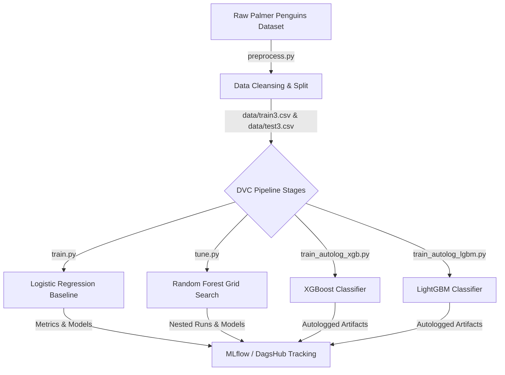

# 🐧 Penguin Species Classification — End-to-End MLOps Pipeline

[](https://www.python.org/)
[](https://dvc.org/)
[](https://mlflow.org/)
[](https://scikit-learn.org/)
[](https://xgboost.readthedocs.io/)
[](https://lightgbm.readthedocs.io/)

> An end-to-end production-grade MLOps architecture for multiclass species classification using the Palmer Penguins dataset. Demonstrates reproducible pipeline orchestration with **DVC**, experiment tracking & remote artifact management via **MLflow** & **DagsHub**, hyperparameter tuning, and model comparison across baseline and gradient boosted algorithms.

---

## 📌 Table of Contents
- [Project Overview](#-project-overview)
- [Architecture & Pipeline Workflow](#-architecture--pipeline-workflow)
- [MLOps Best Practices Demonstrated](#-mlops-best-practices-demonstrated)
- [Model Comparison & Tracking](#-model-comparison--tracking)
- [Repository Structure](#-repository-structure)
- [Getting Started](#-getting-started)
- [Environment Configuration](#-environment-configuration)
- [Pipeline Execution](#-pipeline-execution)
- [Author & Contact](#-author--contact)

---

## 🔍 Project Overview

This repository showcases a complete MLOps workflow designed for model reproducibility, experiment scalability, and robust model evaluation. 

The primary objective is to classify penguin species (*Adelie*, *Chinstrap*, *Gentoo*) using morphological measurements (bill length/depth, flipper length, body mass, island, and sex).

### Key Technical Highlights:
* **Automated Data Preprocessing**: Automated ingestion from raw Seaborn Palmer Penguins dataset, label encoding for categorical features, missing value handling, and split generation.
* **Reproducible DVC Pipeline**: Fully orchestrated multi-stage pipeline defined in `dvc.yaml` managing dependencies, parameters, and generated model outputs.
* **Multi-Model Benchmarking**: Implementation and comparison of:
  * Baseline **Logistic Regression**
  * Hyperparameter-tuned **Random Forest Classifier** (via `ParameterGrid` with nested MLflow tracking)
  * **XGBoost Classifier** (with MLflow autologging)
  * **LightGBM Classifier** (with MLflow autologging)
* **Remote Experiment Tracking**: Integration with **DagsHub MLflow server** for centralized metric tracking, parameter comparison, and model artifact versioning.

---

## 🏗 Architecture & Pipeline Workflow



---

## 🛠 MLOps Best Practices Demonstrated

| Practice | Tool / Framework | Implementation Detail |
| :--- | :--- | :--- |
| **Pipeline Reproducibility** | `DVC` | Standardized `dvc.yaml` pipeline connecting preprocessing, baseline training, hyperparameter tuning, and gradient boosting stages. |
| **Experiment Tracking** | `MLflow` + `DagsHub` | Tracking macro precision, recall, F1-score, train/test accuracy, hyperparameters, and model binaries (`.joblib`, `.json`, `.txt`). |
| **Autologging** | `MLflow Autolog` | Zero-overhead logging for XGBoost (`mlflow.xgboost.autolog()`) and LightGBM (`mlflow.lightgbm.autolog()`). |
| **Hyperparameter Search** | `Scikit-Learn` | Systematically tuned Random Forest models using `ParameterGrid` with parent-child nested MLflow runs. |
| **Environment & Secrets** | `python-dotenv` | Clean separation of code and API credentials using `.env` management and `.env.example` templates. |

---

## 📊 Model Comparison & Tracking

All model runs record comprehensive classification metrics evaluated on test splits:

| Model | Stage Command | Key Features / Notes | Artifact Output |
| :--- | :--- | :--- | :--- |
| **Logistic Regression** | `python train.py` | Baseline classifier (`max_iter=1000`) | `models/log_reg_penguins.joblib` |
| **Random Forest (Tuned)** | `python tune.py` | Grid search over `n_estimators` & `max_depth` with nested MLflow runs | `models_tuned/rf_*.joblib` |
| **XGBoost Classifier** | `python train_autolog_xgb.py` | Multi-class logloss evaluation with MLflow autologging | `models_xgb/xgb_model.json` |
| **LightGBM Classifier** | `python train_autolog_lgbm.py` | LightGBM booster with MLflow autologging | `models_lgbm/lgbm_model.txt` |

---

## 📁 Repository Structure

```text
├── data/                       # Preprocessed training & test datasets (generated)
├── models/                     # Saved baseline Logistic Regression model
├── models_tuned/               # Saved tuned Random Forest model artifacts
├── models_xgb/                 # Saved XGBoost model artifacts
├── models_lgbm/                # Saved LightGBM model artifacts
├── .env.example                # Environment variable configuration template
├── .gitignore                  # Git ignore rules for data, credentials, and artifacts
├── dvc.yaml                    # DVC pipeline orchestration configuration
├── preprocess.py               # Data ingestion, label encoding, and split script
├── train.py                    # Baseline Logistic Regression model training script
├── tune.py                     # Random Forest grid search hyperparameter tuning script
├── train_autolog_xgb.py        # XGBoost classifier training script with MLflow autologging
├── train_autolog_lgbm.py        # LightGBM classifier training script with MLflow autologging
├── requirements.txt            # Python dependencies
└── README.md                   # Project documentation
```

---

## 🚀 Getting Started

### Prerequisites
* Python 3.9 or higher
* Git

### 1. Installation

Clone the repository and set up a virtual environment:

```bash
# Clone the repository
git clone https://github.com/<your-username>/penguin-species-mlops-pipeline.git
cd penguin-species-mlops-pipeline

# Create and activate a virtual environment
python -m venv venv

# Windows
venv\Scripts\activate

# macOS/Linux
source venv/bin/activate

# Install required dependencies
pip install -r requirements.txt
```

---

## 🔑 Environment Configuration

Create a `.env` file in the root directory based on `.env.example`:

```bash
cp .env.example .env
```

Configure your DagsHub MLflow credentials in `.env`:

```env
MLFLOW_TRACKING_URI=https://dagshub.com/<your-username>/<your-repo-name>.mlflow
MLFLOW_TRACKING_USERNAME=<your-dagshub-username>
MLFLOW_TRACKING_PASSWORD=<your-dagshub-token-or-password>
```

---

## 🔄 Pipeline Execution

### Running the Entire DVC Pipeline

To reproduce the full pipeline end-to-end:

```bash
dvc repro
```

### Running Individual Stages

You can also run individual components manually:

```bash
# Stage 1: Preprocessing & Data Splitting
python preprocess.py

# Stage 2: Train Baseline Logistic Regression
python train.py

# Stage 3: Hyperparameter Tuning (Random Forest)
python tune.py

# Stage 4: Train XGBoost Model
python train_autolog_xgb.py

# Stage 5: Train LightGBM Model
python train_autolog_lgbm.py
```

### Viewing MLflow Experiments

If using a local MLflow server or DagsHub:

```bash
mlflow ui
```
Open `http://localhost:5000` in your browser to inspect parameters, metrics, run comparisons, and model artifacts.

---

## 👨‍💻 Author & Contact

**Ayman** — ML / MLOps Engineer  
* GitHub: [@Janaymn](https://github.com/Janaymn)  
* Repository: [Janaymn/MLops_Task3](https://github.com/Janaymn/MLops_Task3)

---
*Feel free to star ⭐️ this repository if you found it useful!*